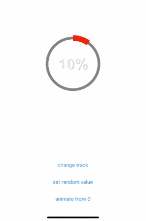
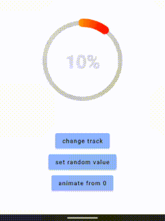

# ti.circularprogress

Circular progress view for Titanium.
Using https://github.com/kaandedeoglu/KDCircularProgress (iOS) and https://github.com/owl-93/Determinate-Progress-View/ (Android).


## Demo

 

## Installation

* Download module
* add `<module>ti.circularprogress</module>` to `tiapp.xml`

### Android

Add this to your build.gralde:
```
repositories {
maven { url 'https://jitpack.io' }
}
```

and you have to target min 22 in your tiapp.xml:
```xml
<uses-sdk android:minSdkVersion="22" />
```


## Example :slightly_smiling_face:

### Alloy
```xml
<CircularProgress module="ti.circularprogress"/>
```

### Classic
```js
var cirularProgressModule = require("ti.circularprogress");
var win = Ti.UI.createWindow({backgroundColor: '#fff'});
var btn = Ti.UI.createButton({title: "animate from 0", bottom: 0});
var btn2 = Ti.UI.createButton({title: "set random value", bottom: 50});
var btn3 = Ti.UI.createButton({title: "change track", bottom: 100});
var lbl = Ti.UI.createLabel({text: "10%", color:"#000"});
var circularProgessView = cirularProgressModule.createCircularProgress({
	height: 200,
	width: 200,
	trackColor: '#777',
	progressColor: ['#f00', "#ff0"],
	roundedCorners: false,
	progressWidth: 50,
	trackWidth: 10,
	duration: 0,
	maxValue: 100,
	progressValue: 10,
	gradientRotateSpeed: 1.0,
	glowAmount: 0.8,
});

circularProgessView.addEventListener('done', function() {
	console.log("reached end value");
	lbl.text = circularProgessView.progressValue + "%";
});

circularProgessView.addEventListener('progress', function(e) {
  console.log("progress: ", e.progress);
	lbl.text = Math.round(e.progress) + "%";
});

btn.addEventListener("click", function() {
	circularProgessView.animateProgress({
		startValue: 0,
		endValue: 100,
		duration: 2000
	});
})

btn2.addEventListener("click", function() {
	var rnd = Math.round(Math.random() * 100);
	circularProgessView.progressValue = rnd;
	lbl.text = rnd + "%";
})

btn3.addEventListener("click", function() {
	circularProgessView.trackWidth = Math.round(Math.random() * 40) + 10;
	circularProgessView.progressWidth = Math.round(Math.random() * 40) + 10;
})
win.add([circularProgessView, btn, btn2, btn3, lbl])
win.open();
 ```

## Properties
* `trackColor` - background track color
* `progressColor` - color of the progress bar. String or array `["start", "middle", "end"]` for gradient
* `roundedCorners` - boolean. flat or rounded corners
* `progressWidth` - width of the progress bar
* `trackWidth` - width of the background track
* `duration` - duration for animation. If 0 `progressValue` won't animate a change
* `maxValue` - maximum value of the progressbar
* `progressValue` - current value of the progressbar

## Events
* `progress` - returns event.progress
* `done` - value is set or animation is done

## Methods
* `animateProgress({startValue, endValue, duration})`

## Authors

- Marc Bender ([@mbender74](https://github.com/mbender74/))
- Michael Gangolf ([@MichaelGangolf](https://twitter.com/MichaelGangolf) / [Web](http://migaweb.de))
